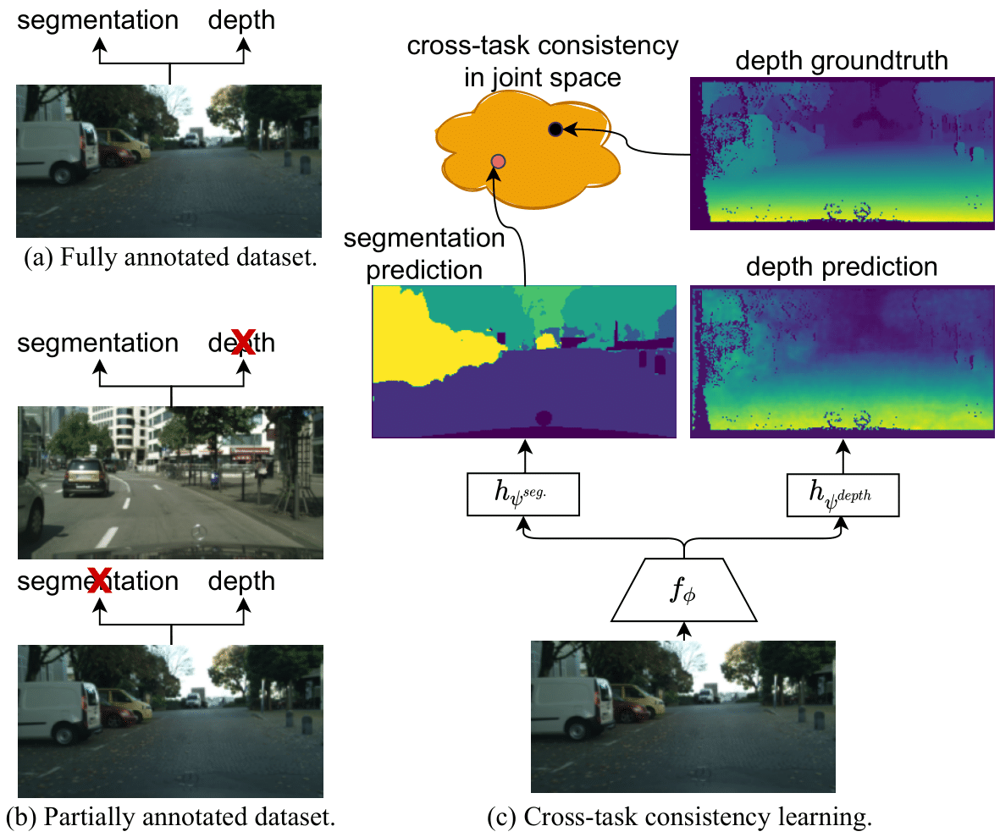

# Learning Multiple Dense Prediction Tasks from Partially Annotated Data
We propose a more realistic and general setting for multi-task dense prediction problems, called multi-task partially-supervised learning (MTPSL) where not all task labels are available in each training image (Fig. 1(b)), which generalizes over the standard supervised learning (Fig. 1(a)) where all task labels are available. And we propose a novel and architecture-agnostic MTL model that penalizes cross-task consistencies between pairs of tasks in joint pairwise task-spaces, each encoding the commonalities between pairs, in a computationally efficient manner (Fig. 1(c)).

<div>
<p align="center">
  
</p>
</div>

> [**Learning Multiple Dense Prediction Tasks from Partially Annotated Data**](https://arxiv.org/abs/2111.14893),            
> Wei-Hong Li, Xialei Liu, Hakan Bilen,        
> *CVPR 2022 ([arXiv 2111.14893](https://arxiv.org/abs/2111.14893))*

## Updates
* June'22 The code on NYU-v2 is now released! The rest code will be available soon!
* June'22, Our paper is listed in [CVPR'22 Best Paper Finalists](https://twitter.com/CVPR/status/1539772091112857600)
* March'22, Our paper is accepted to CVPR'22!

## Features at a glance
- We propose a more realistic and general setting for multi-task dense prediction problems, called multi-task partially-supervised learning (MTPSL) where not all task labels are available in each training image.

- We propose a novel and architecture-agnostic MTL model that penalizes cross-task consistencies between pairs of tasks in joint pairwise task-spaces, each encoding the commonalities between pairs, in a computationally efficient manner.

- We evaluate our method on NYU-v2, Cityscapes, PASCAL-context under different multi-task partially-supervised learning settings and our method obtains superior results than related baselines.

- Our method applied to standard multi-task learning setting (all tasks labels are available in each training images) by learning cross-task consistency achieves state-of-the-art performance on NYU-v2.

- See our [research page](https://groups.inf.ed.ac.uk/vico/research/MTPSL/) for more details

## Requirements
- Python 3.6+
- PyTorch 1.8.0 (or newer version)
- torchvision 0.9.0 (or newer version)
- progress
- matplotlib
- numpy

## Prepare dataset
We use the preprocessed [`NYUv2` dataset](https://www.dropbox.com/sh/86nssgwm6hm3vkb/AACrnUQ4GxpdrBbLjb6n-mWNa?dl=0) provided by [this repo](https://github.com/lorenmt/mtan). Download the dataset and place the dataset folder in `./data/`

## Usage
The easiest way is to download our [pre-trained models](https://drive.google.com/file/d/1s9x8neT9SYR2M6C89CvbeID3XlBRJoEw/view?usp=sharing) learned with our proposed cross-task consistency learning and evaluate it on the validation set. To download the pretrained model, one can use `gdown` (installed by ```pip install gdown```) and execute the following command in the root directory of this project:
```
gdown https://drive.google.com/uc?id=1s9x8neT9SYR2M6C89CvbeID3XlBRJoEw && md5sum nyuv2_pretrained.zip && unzip nyuv2_pretrained.zip -d ./results/ && rm nyuv2_pretrained.zip
    
```
This will donwnload the pre-trained models and place them in the `./results` directory. 

One can evaluate these model by:

```
CUDA_VISIBLE_DEVICES=<gpu_id> python nyu_eval.py --dataroot ./data/nyuv2 --ssl-type onelabel --model ./results/nyuv2/mtl_xtc_onelabel.pth.tar
```

### Train our method 
Training our method with SegNet for multi-task partially-supervised learning settings, e.g. one-label and random-label settings. In one-label setting, i.e. one task label per image, we learn cross-task consistency for multi-task partially-supervised learning:

```
CUDA_VISIBLE_DEVICES=<gpu_id> python nyu_mtl_xtc.py --out ./results/nyuv2 --ssl-type onelabel --dataroot ./data/nyuv2 
```

One may train our method that learns cross-task consistency for multi-task learning with full supervision (`--ssl-type full`):

```
CUDA_VISIBLE_DEVICES=<gpu_id> python nyu_mtl_xtc.py --out ./results/nyuv2 --ssl-type full --dataroot ./data/nyuv2 
```

### Train supervised learning baselines
* Train the single-task learning models with SegNet:
```
CUDA_VISIBLE_DEVICES=<gpu_id> python nyu_stl_sl.py --out ./results/nyuv2 --ssl-type onelabel --dataroot ./data/nyuv2 --task semantic 
```

* Train the multi-task supervised learning model with SegNet:
```
CUDA_VISIBLE_DEVICES=<gpu-id> python nyu_mtl_sl.py --out ./results/nyuv2 --ssl-type onelabel --dataroot ./data/nyuv2
```

## Acknowledge
We thank authors of [MTAN](https://github.com/lorenmt/mtan) and [Multi-Task-Learning-PyTorch](https://github.com/SimonVandenhende/Multi-Task-Learning-PyTorch) for their source code.  

## Contact
For any question, you can contact [Wei-Hong Li](https://weihonglee.github.io).

## Citation
If you use this code, please cite our papers:
```
@inproceedings{li2022Learning,
    author    = {Li, Wei-Hong and Liu, Xialei and Bilen, Hakan},
    title     = {Learning Multiple Dense Prediction Tasks from Partially Annotated Data},
    booktitle = {IEEE/CVF International Conference on Computer Vision and Pattern Recognition (CVPR)},
    month     = {June},
    year      = {2022}
}
```